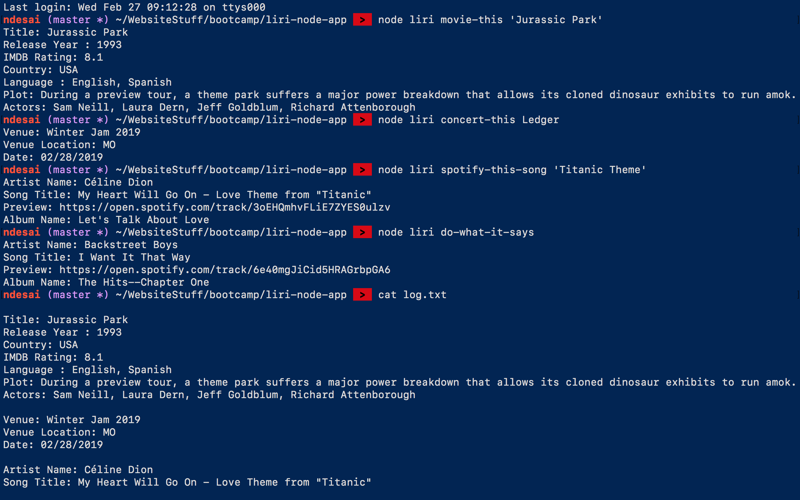

 

  

# "Liri" 
A Node.js CLI application that takes in one of the following command line arguments, and returns data from and API
* **movie-this** : Uses OMDB API to return information about a movie
* **concert-this**  :  Uses Bands In Town API to return information about a concert
* **spotify-this-song**  :  Uses Spotify API to return information about a song
* **do-what-it-says** : Reads arguments from random.txt to perform one of the above commands

## Things I learned
* Setting up a node application
  * Using 'npm' commands
  * Installing and using npm packages
* Reading/Writing to files using file-system module

